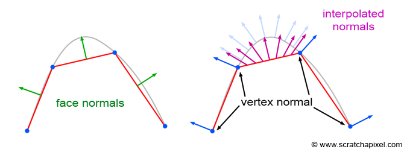
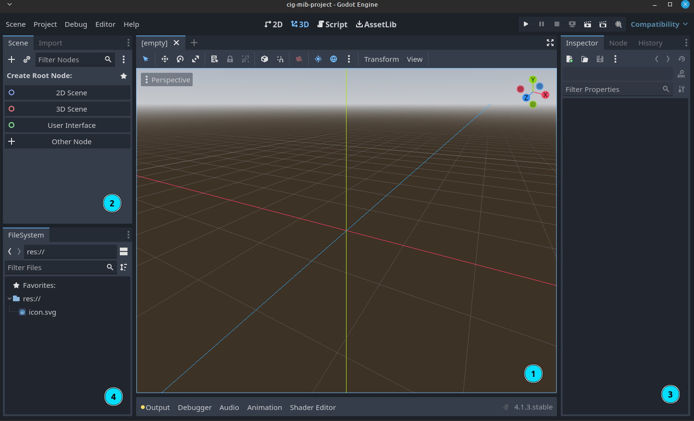

 
## Datenstrukturen in 3D - Meshes

Die wohl wichtigste Methode zur Repräsentation dreidimensionaler Objekte im Speicher eines Computers ist das Drahtgittermodell - englisch Mesh. Hierbei wird die Form eines Objektes approximiert, indem es aus Dreiecken modelliert wird.

*Das Maskottchen der 3D Software Blender als Drahtgittermodell aus Drei-, bzw Vierecken*

Oft wird dem Nutzer von 3D Software auch ermöglicht Formen mit 4 oder noch mehr Eckpunkten zum modellieren zu verwenden, irgendwo auf dem Weg von der Benutzeroberfläche zur Grafikkarte werden diese jedoch immer wieder zu Dreiecken umgewandelt.


Grafikkarten sind über die Jahre immer besser darin geworden große Mengen dieser Dreiecke darzustellen und Lichtsimulationen damit auszuführen. Effekte, die vor ein paar Jahren noch Filmen vorbehalten waren (bei denen jeder Frame Minuten bis Stunden für das Rendering braucht), sind in modernen Videospielen inzwischen in 120 Frames pro Sekunde möglich.




*Findet Nemo (Film) 2003*



*Subnautica (Videospiel) 2018*





Zur Art der Abspeicherung dieser Dreiecke gibt es verschiedene Herangehensweisen. Die einfachste ist es, einfach eine Liste an Punkten zu speichern,
die jeweils aus 3 Werten (x, y, z) bestehen.

Zur Optimierung des Renderings werden die Dreiecke meist nur aus einer Blickrichtung dargestellt ("Backface Culling"). Daher ist auch die Reihenfolge in der die Punkte gespeichert werden wichtig. Normalerweise gehen Renderengines davon aus, dass die Vorderansicht eines Dreiecks die ist, aus der die Eckpunkte der Reihenfolge nach im Uhrzeigersinn gespeichert sind.

**Vertex Indices**  
Letztere Methode funktioniert für einfache Objekte, hat jedoch den Nachteil, dass Eckpunkte (Vertices) die von mehreren Flächen verwendet werden für jede Fläche separat gespeichert werden müssen. Um Speicherplatz und Rechenleistung zu Optimieren wird meist mit sogenannten Vertex Indices gearbeitet.  
Dabei werden die Punkte wie zuvor ein einer Liste gespeichert, jedoch wird eine zusätzliche Liste angelegt, in der jeweils die Indices von drei (oder je nach Format auch mehr) dieser Punkte angegeben werden, die eine Fläche bilden.

*Darstellung eines Vierecks mit einer Liste von Punkten von denen jeweils drei ein Dreieck bilden*

*Darstellung eines Vierecks mit einer Liste von Punkten und einer separaten liste ("Faces"), die angeben wie die Flächen zwischen den Punkten gespannt werden sollen*


Exportiert mit Blender eine 3D Datei mit nur einem einzigen sehr einfachem Objekt (Würfel) als "Wavefront .obj" Datei.
Ignoriert die erzeugte .mtl Datei (diese betrifft Materialien) und öffnet die .obj Datei in einem Texteditor. 
 Dieses Dateiformat ist so simpel, dass sich die einzelnen Vertices und Vertex indices einfach herauslesen lassen. Versucht anhand der [Spezifikation auf Wikipedia](https://de.wikipedia.org/wiki/Wavefront_OBJ) herauszufinden, wie hier Vertices und Vertex Indices gespeichert sind.  
Normalen und Texturkoordinaten interessieren uns hier vorerst nicht


**Normalen**  
Nun da der Computer weiß, wo die Flächen eines Modells sein sollen, wird für die Berechnung der Beleuchtung einer Szene noch die Richtung benötigt, in die jeder Oberflächenpunkt "zeigt" - also der orthogonale Vektor zur Oberfläche. Auch hierfür gibt es verschiedene Herangehensweisen. z.B.:

1. Die Normale wird gar nicht mit abgespeichert sondern für jedes Dreieck live anhand der Vertexpositionen berechnet. Dies hat den Vorteil, dass sich die 3D Software / das Speicherformat nicht um die Normalen kümmern muss. Die Renderengine benötigt dann jedoch mehr Rechenleistung.

2. Die Normalen werden für jede Fläche mit abgespeichert (wie z.B. im .obj Format)

3. Die Normalen werden nicht für jede Fläche, sondern für jeden Vertex mitgespeichert. Das hat den Vorteil, dass die Normalen auf der Fläche dann abhängig zur Distanz zu jedem Eckpunkt interpoliert werden können und somit auch Objekte mit wenig Punkten "weich" gezeichnet werden können.

  
**Face Normals vs Vertex Normals**
source: [https://www.scratchapixel.com/images/shading-intro/shad-face-normals2.png](https://www.scratchapixel.com/images/shading-intro/shad-face-normals2.png)
  
Darstellung einer Kugel mit Face-Normals vs. "Smooth Shading" mithilfe interpolierter vertex normals

## Erste Schritte

**In dieser Übung wollen wir uns mit dem Setup und ersten Schritten mit Godot beschäftigen.**


- Ladet euch zunächst von [godotengine.org](https://godotengine.org/download) die aktuelle Version von Godot herunter. Wir werden für diese Vorlesung nur die Standartversion der Engine (nicht .NET) benötigen.
- Entpackt die .zip Datei.
- Eine Installation ist nicht nötig. Die Engine kann nun mit der .exe Datei (die Datei ohne "_console" am Ende) gestartet werden.


*Dieses Script behandelt die Version 4.2. Zukünftige Versionen könnten eventuell Änderungen vornehmen, normalerweise bleibt die API bei Updates jedoch großteils unverändert.*

Die Engine öffnet sich 

 Der Szeneviewer dient der Vorschau in der 3D / 2D Szene und der transformation von Objekten.  

 In diesem Bereich kann die Szenenhierarchie überblickt und bearbeitet werden.  

 Im Inspector können die Eigenschaften des aktuell ausgewählte Objekts (Node*) bearbeitet werden.  

 Das "FileSystem" ist die tatsächliche Ordnerstruktur des Projekts. Hier werden Texturen, Modelle und Scripte gespeichert und verwaltet.  



**freie Arbeit (45-60min)**  
Arbeite die Godot Dokumentation ["Getting started"](https://docs.godotengine.org/en/stable/tutorials/3d/procedural_geometry/index.html) (oder [auf deusch](https://docs.godotengine.org/de/4.x/getting_started/introduction/index.html)) durch oder mache dich anderweitig mit den Grundkonzepten von Godot bekannt. Die Sektion "Your first 2D Game" kann übersprungen werden, da wir uns hier ausschließlich mit der 3D Funktionalität von Godot beschäftigen werden.  



## Meshgenerierung mit Godot

Godot stellt uns viele mächtigere Tools zur Verfügung um in-code 3D Objekte zu generieren. Wir fangen hier nun mit der 

Ein [ArrayMesh](https://docs.godotengine.org/en/stable/classes/class_arraymesh.html)
 in Godot wird aus einem Array erzeugt, bei dem jeder Eintrag ein weiterer Array ist. Der Aufbau ist ähnlich dem einer .obj Datei.  
Der erste Subarray enthält alle Vertexpositionen, der zweite die Vertexnormalen (in der selben Reihenfolge), dann folgen Texturcoordinaten etc.
Schließlich ist der 12. Subarray der Vertex-Indices Array, der bestimmt, zwischen welchen Punkten die Flächen gezogen werden sollen. Dieser ist optional - wird er nicht angegeben, werden wie oben die Dreiecke einfach der vorkommenden Reihenfolge nach gezogen.

 [Siehe ArrayType](https://docs.godotengine.org/en/stable/classes/class_mesh.html#enum-mesh-arraytype)



Nutzt Godots ArrayMesh, um ein Mesh (eurer Wahl) zu generieren.

  
Erzeugt dazu eine 3D Szene

Fügt dem Node3D als Kind einen *Meshinstance* Node hinzu

Fügt diesem nun ein script hinzu und gebt ihm folgenden Inhalt:


@tool # ermöglicht es Skripte im Editor (ohne dass das Spiel gestartet werden muss) auszuführen
extends MeshInstance3D

@export var regenerate_mesh: bool:
	set(value):
		create_mesh()

func create_mesh():
	pass


Die genaue Funktion von Zeile 4-6 ist vorerst nicht wichtig - das sorgt nur dafür, dass ihr nun im 3D Editor wenn MeshInstance selektiert ist einen "Regenerate Mesh" Button rechts hat, der die Funktion `create_mesh()` ausführt.

Fügt nun euren Code in die Funktion `create_mesh()` ein. Hilfreich ist hier die [Dokumentation zu ArrayMeshes](https://docs.godotengine.org/en/stable/classes/class_arraymesh.html).

