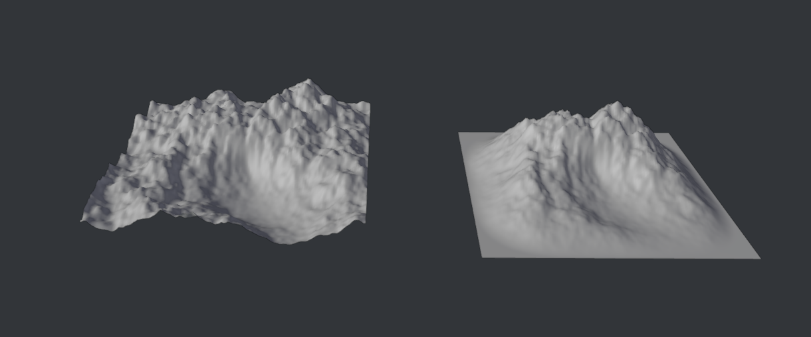
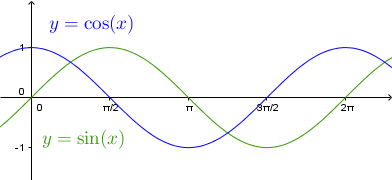
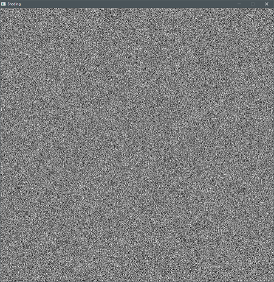
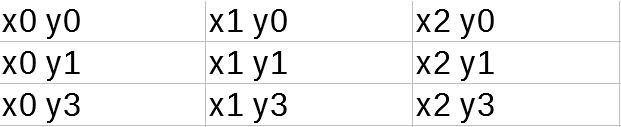
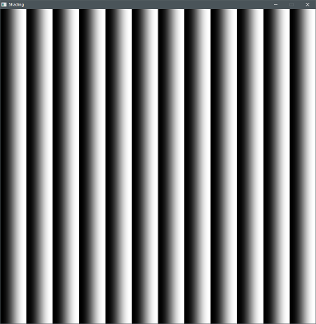
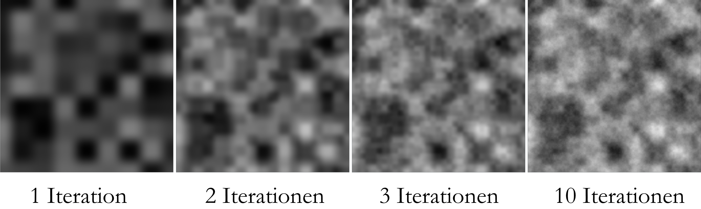

**Im letzten Kapitel haben wir damit begonnen, een Script zu schreiben, welches uns eine prozedurale Landschaft generiert. Damit wollen wir nun weitermachen.**


## 2.1 Normalen berechnen
Beim letzten mal haben wir mit unserem Code sehr kleinteilig direkt auf den Meshdaten gearbeitet. Dazu nutzten wir Godots ArrayMesh-Datentyp. Godot bietet uns jedoch auch ausgereiftere Tools um mit Meshes zu arbeiten. Generell ist es ratsam bereits in einer Engine existierende Funktionalität nicht neu zu erfinden. Deswegen bauen wir unseren Code nun zunächst so um, dass er Godots [PlaneMesh](https://docs.godotengine.org/en/stable/classes/class_planemesh.html) statt des von uns generierten Gitters nutzt. Zudem wollen wir Die Normalen des Meshes berechnen, um die Beleuchtung des Geländes zu ermöglichen.


Baue das Script vom letzten mal so um, dass es Godots [**PlaneMesh**](https://docs.godotengine.org/en/stable/classes/class_planemesh.html) und das [**SurfaceTool**](https://docs.godotengine.org/en/stable/tutorials/3d/procedural_geometry/surfacetool.html) nutzt um das Mesh + Normalen zu generieren




## 2.2 Terrain Falloff

Für die meisten Anwendungsfälle ist es nützlicher, wenn unser Terrain zu den Kanten hin langsam abflacht anstatt einfach aufzuhören:



Wir benötigen daher nun eine Funktion, um den Einfluss der Deformation abhängig von der Entfernung zum Rand zu kontrollieren.


- Schreibe eine Funktion, die anhand der x und z Koordinaten einen Wert zwischen 0 und 1 ausgibt. Je weiter näher der Punkt am Rand des Geländes ist, desto niedriger soll dieser Wert sein.
- Nutze diese Funktion, um den Einfluss der Deformation zu kontrollieren.

**Tipps:**
- in der Mitte des Terrains gilt x=0, y=0
- 



## 2.3 FBM und Perlin
Eine der wichtigsten prozeduralen Texturen in der Computergrafik ist das sogenannte Perlin Noise. Wir nutzen es zum Beispiel, um eine Landschaft zu generieren. Benannt wurde diese Technik nach dem Erfinder Ken Perlin, der für diese für den Film "Tron" entwickelte und einen Oscar gewann. Zwar gibt es in den meisten Umgebungen schon vorgegebene Funktionalität für Noise, es kann jedoch nicht schaden zu wissen, wie es grob funktioniert. Hier wird daher konzeptionell eine Vereinfachte Variante der Funktion erklärt.

### Random
Die Generierung von zufälligen Zahlen ist mit Computern nicht so einfach, wie es erscheinen mag. Meist werden dabei Algorithmen verwendet, die für einen bestimmten Startwert (Seed) eine pseudozufällige Zahl zurückgeben. Die im [*Book od Shaders*](https://thebookofshaders.com/) definierte Funktion ist:

```glsl
y = fract(sin(x)*1.0);
```

*The Book of Shaders: Random (thebookofshaders.com/10/)*

klein genug skaliert und auf das Skalarprodukt eines Inputvektorsangewandt und eines zweiten fest definierten Vektors folgt daraus ein homogenes Rauschen, wenn es z.b. wie hier direkt auf die Texturkoordinaten angewandt wird.

```glsl
// 2D Random
float random (in vec2 st) {
    return fract(sin(dot(st.xy,
        vec2(12.9898,78.233)))
            * 43758.5453123);
}
```



### Noise
Um mithilfe dieser `Random` Funktion nun ein gleichmäsigeres Rauschen zu erzeugen, wird zunächst ein vec2 `i` erzeugt, der die Texturkoordinaten auf die darunterliegente ganzzahligen Integer rundet. Für daraus erbibt sich dann ein Gitter, welches Zellen je nach Skalierung der Textur besitzt und für jede Zelle einen X und Y Wert von 0-Skalierung definiert.

*Beispiel für Skalierung = 3*



Diese Werte werden dann verwendet, um einen zufälligen Wert pro Zelle zu generieren.


Das wird nun noch drei mal wiederholt, wobei die Koordinaten jeweils um 1 nach rechts, nach unten und nach rechts unten versetzt werden. Daraus ergeben sich die Bilder a,b,c und d.
  
Schließlich wird der Restwert von i (`fract`) ermittelt und mithilfe einer sogenannten quintic interpolation curve weicher dargestellt.  
  
Mit diesem Wert werden die vier Texturen dann prozentual gemischt, um einen Übergang zwischen den vier Texturen zu erzeugen.  


```glsl
// Aus Book Of Shaders -
// 2D Noise based on Morgan McGuire @morgan3d
// https://www.shadertoy.com/view/4dS3Wd
float noise(in vec2 st) {
    vec2 i = floor(st);

    // 4 Ecken erzeugen
    float a = random(i);
    float b = random(i + vec2(1.0, 0.0));
    float c = random(i + vec2(0.0, 1.0));
    float d = random(i + vec2(1.0, 1.0));

    vec2 f = fract(st);

    //quintic interpolation curve
    u = f*f*f*(f*(f*6.-15.)+10.);

    // 4 Ecken prozentual mischen
    return mix(a, b, u.x) +
            (c - a)* u.y * (1.0 - u.x) +
            (d - b) * u.x * u.y;
}
```
### Iterationen
Mehrere Ergebnisse der oben beschriebenen Funktion, können nun übereinandergelegt werden um ein detailierteres Ergebnis zu erzielen. Dabei wird mit jeder weiteren sogen. Oktave die Skalierung erhöht (Textur verkleinert) und mit einem immer niedriger werdenden Wert (amplitude) zum bisherigen Ergebnis hinzugefügt.
Dieser iterative Prozess wird Fractal Brownian Motion - fbm Noise genannt.

  
 

```glsl
float fbm(in vec2 st, int OCTAVES) {

    float value = 0.0;
    float amplitude = .5;

    // Loop octaves
    for (int i = 0; i < OCTAVES; i++) {
        value += amplitude * noise(st);

        st *= 2.;           //Skalierung erhöhen
        amplitude *= .5;    //Amplitude verringern
    }
    return value;
}
```

## 2.4 Terrain Shading
Wenn wir die Landschaft schon komplett im Code generieren, haben wir natürlich auch gar keine Lust, sie von Hand anzumalen. Wir brauchen daher noch eine Möglichkeit zu Texturierung des Meshes. Wir wollen zunächst eine verschneite Landschaft generieren und müssen daher nun eine Maske generieren, die zwischen Schnee und Fels mischen kann.



Überlege dir, anhand welcher Parameter so eine Unterscheidung stattfinden könnte und finde heraus, wie in Godot automatische Texturierung stattfinden könnte.
