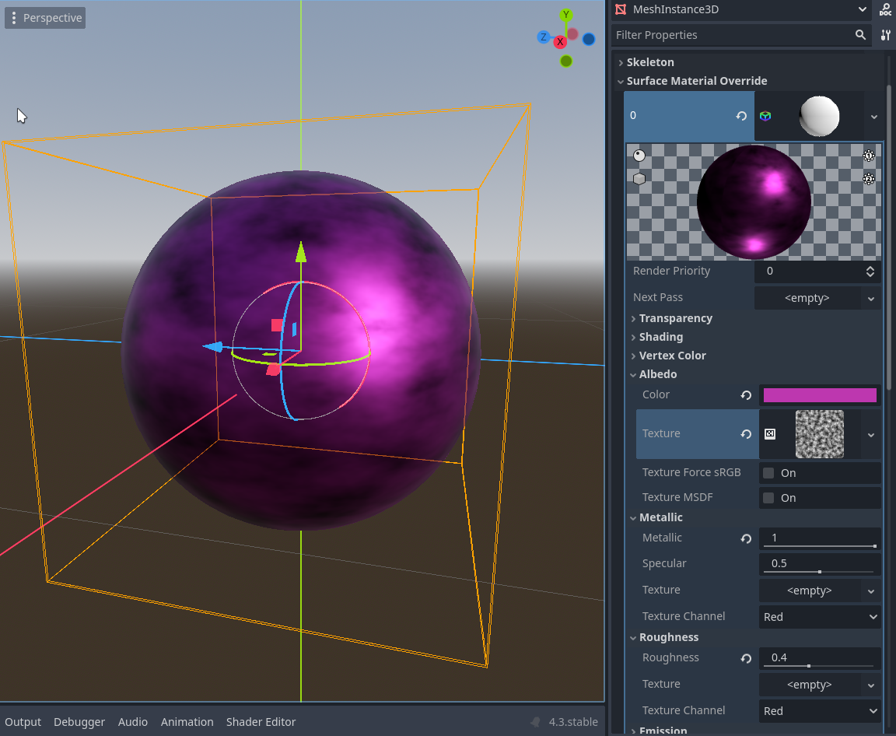
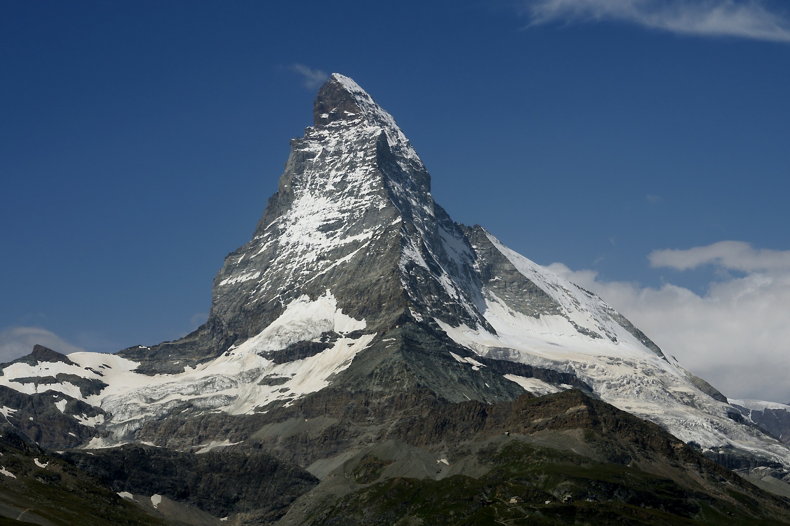

**Wenn wir die Landschaft schon komplett im Code generieren, haben wir natürlich auch gar keine Lust, sie von Hand anzumalen. Wir brauchen daher noch eine Möglichkeit zu Texturierung des Meshes.**

Godot und die meisten anderen Game Engines bieten uns vielerlei Möglichkeiten Materialien für Spielobjekte zu definieren. Dabei geht kommen neben der Farbe großteils die schon von Blender bekannten Materialeigenschaften  des physikalisch basierten Renderings zu tragen.


- Füge einen *MeshInstance* Node hinzu und gib ihm z.B. ein *SphereMesh*
- Füge unter "Surface Material Override"  ein *Standard Material* hinzu.
- Experimentiere mit den verschiedenenen Parametern des Materials. Versuche dich z.B. an Plastik, Kupfer, Wachs (tipp Subsurface Scattering), Autolack (tipp Metallic + Clearcoat)...



Nun haben wir also Godots integriertes Materialsystem kennengelernt. Damit könnten wir nun schon die meisten Objekte darstellen - für unseren Terraingenerator brauchen wir aber ein System, mit dem wir Texturen abhängig vom Gelände automatisch generieren können. Für solche Anwendungsfälle können wir den Code, der die Materialien erzeugt auch selbst schreiben.

**Wir wollen zunächst eine verschneite Landschaft generieren und müssen daher nun eine Maske generieren, die zwischen Schnee und Fels mischen kann.**


Überlege dir, anhand welcher Parameter so eine Unterscheidung stattfinden könnte.

- Füge dem Terrain Mesh under *Surface Material Overrides* ein ShaderMaterial hinzu und diesem wiederum einen Shader. Klicke diesen an und es öffnet sich der Code Editor mit folgendem Code.


shader_type spatial;

void vertex() {
	// Called for every vertex the material is visible on.
}

void fragment() {
	// Called for every pixel the material is visible on.
}
 

Hier sind bereits zwei Funktionen *vertex* und *fragment* deklariert. *vertex* kontrolliert jeden einzelnen Vertex unseres Meshes und *fragment* jeden einzelnen Pixel, der vom Material in die Kamera fällt. Lese dir zunächst den Teil der Godot-Dokumentation grob durch: [**Introduction to shaders**](https://docs.godotengine.org/en/stable/tutorials/shaders/introduction_to_shaders.html) .

Füge dort folgenden code in die *fragment* Funktion ein:


void fragment() {
    ALBEDO = vec3(1.0, 0.0, 0.0);
}


Das Terrain sollte nun rot erscheinen. Warum? Godot stellt uns in der Shadersprache den **ALBEDO**-Wert zur Manipulation bereit. Dieser bestimmt die Farbe des Objekts. Farben sind in Shadern als "vec3" also Vektor mit 3 Werten (Rot, Grün, Blau) oder - falls Transparenz im Spiel ist als vec4 (R,G,B,Alpha) deklariert. `ALBEDO = vec3(1.0, 0.0, 0.0);` sagt also: Der Albedo Wert des Materials soll 1.0 Rot, 0.0 Grün und 0.0 Blau sein - also Rot.

