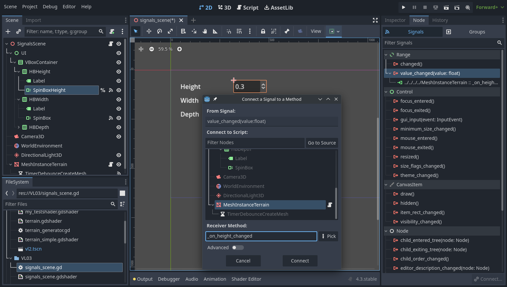

Oft brauchen wir bei der Gestalltung von 3D Szenen und Spielen Möglichkeiten zur Interaktion zwischen verschiedenen Objekten in der Szene. Hier kommen [Signale](https://docs.godotengine.org/en/stable/getting_started/step_by_step/signals.html) ins Spiel. Das sind Nachrichten, die Nodes aussenden, wenn etwas Bestimmtes mit ihnen passiert, z.B. wenn ein Button gedrückt wird oder ein Objekt mit einem Collider kollidiert. Andere Nodes können sich mit diesem Signal verbinden und eine Funktion aufrufen, wenn das Ereignis eintritt.


**Warum Signals statt einfach Methoden auf anderen Objekten direkt aufrufen?**  
Signals bieten den Vorteil, dass ihnen erstmal egal ist, wer der Empfänger des Signals ist - oder ob es überhaupt einen gibt. Objelte die mit Signalen arbeiten sind somit wesentlich flexibler und modularer einsetzbar als "hardvertratete" Objekte. In Godot gibt es das Prinzip "Call down, Signal up". Bedeutet: Hierarchisch übergeordnete Objekte dürfen zwar Methoden ihrer "Kinder" direkt aufrufen, die "Kinder" Objekte sollten Methoden und Parameter ihrer "Eltern" jedoch nicht direkt aufrufen, da dies dazu führen würde, dass die Kindobjekte nicht für sich selbst ohne ein spezielles übergeordnetes Objekt  funktionieren können. Hier kommen dann Signale zum Einsatz. Das übergeordnete Objekt schickt ein Signal und die Kinder hören darauf. Woher das Signal kommt, ist ihnen egal.


## UI mit Signals bauen

Wir wollen für unseren Terraingenerator nun eine Benutzeroberfläche bauen, in die wir die Parameter des Generators eingeben können und daraufhin ein Signal an unser Terrain schicken, um es neu zu generieren.


**Baue zunächst die grafische Benutzeroberfläche für den Terraingenerator.**  
Nutze z.B. das "SpinBox" Element, um ein Zahleneingabefeld zu erzeugen. Erstelle Eingabemasken für alle wichtigen parameter des Terraingenerators und beschrifte sie (Labels). Verwendet "HBox" und "VBox" Nodes, um die Elemente anzuordnen. Mehr Infos zu UI findet ihr in der [Dokumentation](https://docs.godotengine.org/en/stable/tutorials/ui/index.html).

- Verbinde nun deine UI Elemente mittels Signalen mit dem Code
    - Selektiere z.B. den für die Höhe zuständigen SpinBox Node, seletiere im Panel rechts den "Node" Tab und rechtsklicke das Signal *value_changed*.
    - Wähle *connect* und selektiere das Terrain. gebe einen Funktionsnamen an wie z.B. _on_height_changed
    

- öffne nun wieder das Script des Terrains und bearbeite die erstellte Funktion. In dieser setzen wir nun die höhe des Terrains auf den vom Signal gesendeten Wert und regenerieren das Mesh.


func _on_height_changed(value: float):
	height = value
	create_mesh()


- Wiederhole diese Schritte für andere relevante Parameter der Terraingenerierung.



Nun haben wir eine UI gebaut, die bei jeder Werteänderung das Mesh neu generiert. Schon ganz schick, jedoch gobt es noch ein Problem - bedient man die Regler, wird viel zu schnell hintereinander die Neugenerierung des Meshes ausgelöst. Da kommt natürlich kaum ein Computer hinterher.

Optimal wäre es, einen Timer einzubauen, der von z.B. 500 Millisekunden herunterzählt und erst bei 0 das Mesh neu generiert. Jede Bedienung eines Parameters setzt den Timer zurück auf 500ms.


Überlege dir eine Möglichkeit den [***Timer***](https://docs.godotengine.org/en/stable/classes/class_timer.html) Node und dessen Signal *timeout* zu nutzen, um die Meshgenerierung so zu "drosseln".

- Der Timer Node hat eine Methode "start()", die die eingestellte *wait time* zusücksetzt und das Signal *timeout* wird dann [*wait time*] Sekunden danach gesendet.


Nun können wir beliebig mit den Werten des Terraingenerators herumspielen, ohne dass unser CPU an sein Limit kommt.
