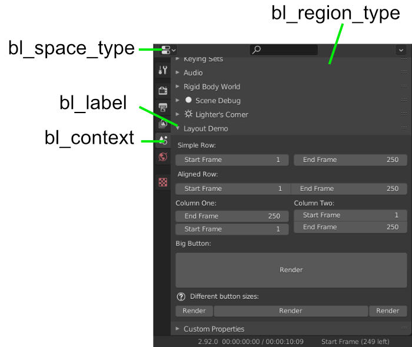

**In Übung 3 haben wir uns schon mit der Erstellung von Operatoren beschäftigt und damit auch die ersten Schritte in Richtung GUI gemacht. In dieser Übung wollen wir unser eigenes Panel bauen und Operatoren zu Menüs hinzufügen.**




- Wir fangen damit an, unser [Skript aus Übung 4](../../course-python-scripts/#vl4-meshgenerierung---gra%C3%9Fb%C3%BCschel) zum Generieren von Graßhalmen in einen Operator innerhalb eines Addons umzuwandeln. Seht euch dazu nocheinmal Übung 3 an. 
- Wir wandeln wir die Konstanten (BLADES, HEIGHT, ANGLE_BASE....) oben in die einsprechenden [Properties](../../chapter03/exercise01_a/#properties-hahahugoshortcode-s4-hbhb) um und transferieren den Code in die `execute` Methode des Operators.
- Fügt schließlich die [`bl_info`](../../chapter03/exercise01_a/#addons-hahahugoshortcode-s8-hbhb) Felder und die `register` und `unregister` funktionen hinzu.




## Panel-Klasse 

Nun brauchen wir ein Panel, von dem aus wir unseren Operator aufrufen wollen. Öffnet dazu zunächst in Blender das Script Template "UI Panel". Dieses zeichnet im Properties Editor → Scene ein Panel.

Hier fällt uns nun einiges auf:

- Wie auch Operatoren, werden UI Elemente auch in einer Klasse definiert, die von `bpy.types.Panel` erbt und über die `register` und `unregister` Funktionen registriert.
- über überschreibbaren Klassenmember werden weitere Infos angegeben:

```python
class LayoutDemoPanel(bpy.types.Panel):
    """Creates a Panel in the scene context of the properties editor"""
    bl_label = "Layout Demo"
    bl_idname = "SCENE_PT_layout"
    bl_space_type = 'PROPERTIES'
    bl_region_type = 'WINDOW'
    bl_context = "scene"
```

|Name | Beschreibung|
|-|-|
| bl_label | Label des Panels |
| bl_idname | Name für den Zugriff über bpy |
| bl_space_type | In Welchem Editortyp ist das Panel (Liste aller typen hier: ) |
| bl_region_type | in welchem Bereich der UI dieses Editors |
| bl_category (nicht hier) | In welchem Tab erscheint das Panel |
| bl_context | In welchem Kontext erscheint das Panel (im Beispiel des Properties Editor: Tab)) |



## `draw` & `layout`

- Statt der execute Methode gibt es hier nun eine `draw` Methode, die das Panel an den oben angegebenen Ort zeichnet.
- Das geschieht über das `self.layout` des Panels.
- in diesem Beispiel wird zunächst ein Label erstellt, dann eine Zeile (`row`)
- Der Zeile werden dann zwei Properties hinzugefügt. Dabei handelt es sich um in der API bereits existierende Properties der `scene` - `frame_end` und `frame_start` (diese sind ansonsten in der Timeline als *Start* und *End* dargestellt)

Oft ist es hilfreich, den Quellcode existierender UI Elemente anzuzeigen (RMB → Edit Source), um herauszufinden, wie die UI aufgebaut ist.


```python
layout = self.layout

scene = context.scene

layout.label(text=" Simple Row:")

row = layout.row()
row.prop(scene, "frame_start")
row.prop(scene, "frame_end")
```

- Wenn der Zeile der Parameter `align=True` übergeben wird, werden die Properties darin direkt nebeneinander dargestellt.
```python
row = layout.row(align=True)
```

- Auch Spalten sind möglich, denen dann wie zuvor der row Elemente hinzugefügt werden können

```python
split = layout.split()

col = split.column()
col.label(text="Column One:")
```

- UI Elementen können auch Icons gegeben werden: `layout.label(text="My Label", icon="QUESTION")`
- Die Namen der Icons lassen sich einfach herausfinden, indem das vorinstallierte Addon "Icon Viewer" installiert wird. Dann erscheint dazu ein Button oben in der *Python Console*


## Operatoraufruf

- Operatoren können dem Layout direkt, reihen oder spalten über deren Methode `operator` hinzugefügt werden. Dazu müssen wir lediglich den Pfad (`bl_idname`) des Operators übergeben.
```python
myrow.operator('mesh.add_grassblade'
  text='Add Grassblades',
  icon='OUTLINER_OB_HAIR'
)
```

- Um den Operator in der UI mit angepassten Default-Werten aufzurufen, kann der Operatorbutton auch in einer Variable gespeichert werden, deren Properties dann angepasst werden.

```python
op_grass = myrow.operator('mesh.add_grassblade'
  text='Add many Grassblades',
  icon='OUTLINER_OB_HAIR'
)
op_grass.BLADES = 30
```

### Operator Presets

Ein Preset Panel lässt sich dem Operator Menü sehr einfach hinzufügen, indem `bl_options` der **Operatorklasse** neben `REGISTER` und `UNDO` zusätzlich noch `PRESET` übergeben wird.


## Operator zu existierendem Menü hinzufügen

- Eine Operatorklasse können wir einem existierendem Menü hinzufügen, indem wir zunächst eine Funktion erstellen, die dem `layout` des übergebenen context wie bereits beim Panel einen Operator hinzufügt.

```python
def add_object_button(self, context):
    self.layout.operator(
        OBJECT_OT_add_object.bl_idname,
        text="Add Object",
        icon='PLUGIN')
```

- in der `register` Funktion fügen wir dann dem in `bpy.types` gespeichertem Menü usere Buttonfunktion hinzu un
- `VIEW3D_MT_mesh_add` bedeutet hier *View3d Editor → **Me**nu **T**op* → Add → Mesh
- in `unregister` müssen wir den Eintrag auch wieder entfernen.

```python
def register():
    bpy.utils.register_class(OBJECT_OT_add_object)
    bpy.types.VIEW3D_MT_mesh_add.append(add_object_button)


def unregister():
    bpy.utils.unregister_class(OBJECT_OT_add_object)
    bpy.types.VIEW3D_MT_mesh_add.remove(add_object_button)
```

## Ressourcen & Tutorials zum Thema

| Art/Länge | Titel | Beschreibung | Quelle |
|---|---|---|---|
|  19min | [Scripting for Artists #10: User Interfaces](https://cloud.blender.org/training/scripting-for-artists/5e9953ab173f1d99c7826902) | Tutorial zu UI Panels | [Blender Cloud](https://cloud.blender.org) |
| | [Using Blender's presets in Python](https://sinestesia.co/blog/tutorials/using-blenders-presets-in-python/) | Offizielle Blender API Dokumentation | [SINESTESIA](https://sinestesia.co/) |
| | [UI Layout Dokumentation](https://docs.blender.org/api/current/bpy.types.UILayout.html) | Offizielle Blender API Dokumentation | [Blender Python API Dokumentation](https://docs.blender.org/api/current/index.html) |
| | [Spacetype Dokumentation](https://docs.blender.org/api/current/bpy.types.Space.html#bpy.types.Space.type) | Offizielle Blender API Dokumentation | [Blender Python API Dokumentation](https://docs.blender.org/api/current/index.html) |
